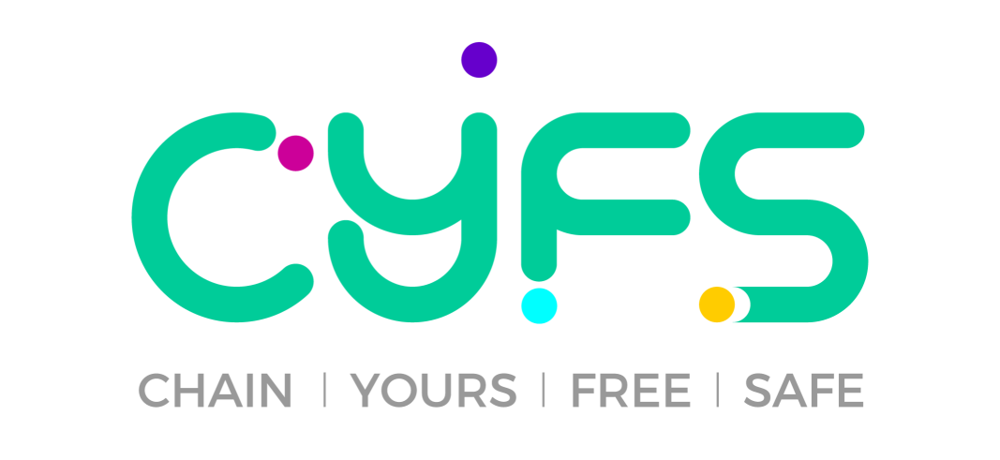

***CYFS：Next Generation Protocl Family to Build Web3***    
+ 官方主页: [https://www.cyfs.com/](https://www.cyfs.com) ,[cyfs://cyfs/index_en.html](cyfs://cyfs/index_en.html)  
+ Discord 讨论组：[https://discord.gg/dXDxjXTEjT](https://discord.gg/dXDxjXTEjT)   
+ CYFS白皮书(Coming soon)   

# Introduce

CYFS通过升级Web的基础协议（TCP/IP+DNS+HTTP），实现了真正的Web3。它采用颠覆性的架构设计，每一个人带着自己的OOD(Owner Online Device)进入，形成一个真正去中心化的网络。

我们对Web3的定义如下：
- Web3让每个人平等的拥有在Internet上保存数据、发布数据、并通过数据得到收入的权利。
- Web3的互联网应用是完全去中心化的，开发者拥有发布和更新应用的权利，用户则拥有永久使用的权利。
- Web3的数据创建即确权，并使用Trust Link链接在一起形成`有权数据网`，这是让数据展现其真正价值的未来语义网。

经过6年的研发，我们在CYFS测试网已经实现了上述目标。CYFS的理论和协议详细设计，请参看相关文档。核心代码开源是CYFS的重要里程碑，标志着其设计已经基本稳定，进入开放的社区驱动研发阶段，我们期待有更多的人一起共建属于所有人的Web3。

这是CYFS协议栈在github上的仓库。虽然我们已经在CYFS测试网上搭建了去中心的GitHub(CodeDAO)，实现了CYFS的去中心自举。但在CYFS主网上线前，我们还是决定在WEB2.0里再多待一会，以该仓库为目前的社区驱动研发基地。CYFS主网上线后，该Repo会整体搬迁到CodeDAO。

本仓库仅包含CYFS核心系统的实现。并未包含CYFS生态重要的基础软件:CyberChat和CYFS Browser，也未包含面向不同语言的开发者的SDK实现。下面是CYFS生态其它重要的开源项目列表（持续更新）

- [cyfs-ts-sdk](https://github.com/buckyos/cyfs-ts-sdk):基于typescript实现的cyfs-sdk，帮助typescript开发者构建Web3 DEC App。
- CYFS Transmission Lab:对CYFS协议进行测试的网络实验室所用系统 (Coming soon)
- CyberChat: CYFS钱包，管理DID,OOD,DECApp以及数据资产（Coming soon）
- CYFS Browser: 基于Chrome内核，支持cyfs://协议的浏览器（Coming soon）
- CodeDAO:用CYFS实现的去中心的Github （Coming soon）

# Background

上面是CYFS的整体架构图，可以帮助建立对CYFS设计的宏观理解。CYFS的核心设计可以分解为下面几个部分

- NamedObject的设计与`cyfs://o/$ownerid/$objid` (Object Link)的两端式构造。
- BDT协议改进了TCP/IP:网络协议从面向地址进化成面向可信身份。
- MetaChain 升级DNS,实现去中心寻址，并实现Data is Account。
- Owner在网络上部署自己的服务器OOD(Owner Online Device)，支持了cyfs://的去中心可访问性
- 基于`有纠纷才上链`的博弈型共识理论设计存储证明和服务证明，实现cyfs://的去中心高可靠和高可用
- 计算资源的链下交付与链上撮合分离，用可演进的经济模型构建去中心的共享云计算
- 基于可信计算的输入与结果的数据产权分析，实现从链上智能合约到链下Data Exchage Contract(DEC)的进化。
- Web3 DEC App的Service端安装在每个人的OOD上，实现了应用服务的去中心化

这些设计是为了解决哪几个关键问题？（我们相信“找到正确的问题已经完成了一半~”）可以阅读 《[CYFS Architecture](doc/zh-CN/CYFS%20Architecture.pptx)》 与 《CYFS 白皮书》(coming soon)，这些内容量比较大，可以边实践边理解~

# Quick Start

下面将通过编译CYFS源码来构建你自己的Web3环境，并在这个环境中完成Web3的基础体验：
- 将一个文件夹发布到Web3的世界，得到一个cyfs://o/$ownerid/$dirid/index.html的永久地址，该地址可用CYFS Browser访问。
- 使用cyfs get命令下载刚刚发布的文件夹中的文件。

注意这个环境正常并不是孤立的，而是能够加入到CYFS网络的（我们有规划3个网络:nightly,beta,relase，目前只有nightly是可用的），所以下面的教程并不包含用源码编译MetaChain+SN的部分。如果你打算在一个独立环境搭建一套完整的系统，需要编译并部署MetaChain超级节点，请阅读文档《MetaChain的构建》(Coming soon)。

## 进行编译
这个基础体验需要以下几个独立的组件，这些组件都是开源，并可以独自编译的。也可以将官方版本和自己编译的版本混合使用
- OOD: 可以参考文章[Hello CYFS 0:编译并部署DIYOOD](doc/zh-CN/Hello_CYFS/0.编译并部署DIYOOD.md), 从源码编译并部署DIYOOD
- 超送：用来管理用户身份，绑定自己的OOD和CYFS Browser，当前可以从官网下载
- CYFS Browser：通过cyfs链接，访问自己或别人发布的网站，当前可以从官网下载
- CYFS Tool: 基于Node.js的命令行工具，提供upload和get命令。当前可以通过`npm i -g cyfs-tool-nightly`安装

## 使用刚刚编译组件
在一台已经安装CYFS浏览器，并激活的机器上，安装CYFS Tool：

使用命令`cyfs upload <file_path> -t ood`, 将本地<file_path>指向的文件，上传到OOD上。

使用命令`cyfs get <对象链接> -s <save_path>`，可以将文件通过cyfs-runtime协议栈下载到本地

更加具体的说明，以及参数的含义，可以参照文章[Hello CYFS 2:发布文件并下载](doc/zh-CN/Hello_CYFS/2.%E5%8F%91%E5%B8%83%E6%96%87%E4%BB%B6%E5%B9%B6%E4%B8%8B%E8%BD%BD.md)

使用命令`cyfs upload <folder_path> -t ood`，通过发布一个文件夹来发布一个静态网站。该命令会输出一个cyfs链接。将链接填入CYFS浏览器的地址栏，就可以通过CYFS浏览器，查看你刚刚发布的网站

更加具体的说明，可以参照文章[Hello CYFS 3:发布网站并查看](doc/zh-CN/Hello_CYFS/3.%E5%8F%91%E5%B8%83%E7%BD%91%E7%AB%99%E5%B9%B6%E6%9F%A5%E7%9C%8B.md)

# 代码导读
通过上面的流程，你已经对CYFS的设计和使用有了一个基本的认识。尽管CYFS的设计已经基本稳定，但我们还有不少的代码要写。我们非常渴望你的帮助，但肯定也不会特别多的精力去编写文档（细节都在源码里了~）。这里我们做一个极简的代码导读，希望能帮助你更快的理解CYFS的实现。

根据架构我们可知,cyfs://的核心是 Object Linke的构造和获取，而获取的前提是至少要把数据上传到OOD上。流程如下:
1. 启动本地协议栈(cyfs-rutnime)
2. 本地计算目录内所有文件的Hash，并以当前的PeopleId为Owner构造FileObject
3. 本地生成Map结构（目录结构），并以当前的PeopleId为Owner构造MapObject,
   此时cyfs://已经完成构造，但此时该cyfs:// 还无法被访问
4. 将上述命名对象和命名数据添加到本地协议栈
5. 向OOD发起CYFS PUT操作:将MapObject保存到OOD上并设置访问权限为公开
6. 让OOD启动MapObject Prepare，在OOD上保存一份命名数据
7. OOD上MapObject Prepare完成，cyfs:// 可以被访问

随后使用`cyfs get`获取的流程如下：

1. 启动本地协议栈cyfs-runtime
2. 用HTTP协议向cyfs-runtime发起HTTP GET请求
3. cyfs-runtime在本地缓存中查看对象是否存在
4. cyfs-runtime发起NamedObject查询需求(下列行为不是串行的)
    4.1 向OOD查询NamedObject
    4.2 OOD查询本地，NamedObject是否存在
    4.3 OOD查询MetaChain，NamedObject是否存在
    4.4 OOD根据get中的Reference信息，在上一跳设备上查询NamedObject是否存在
    4.5 OOD通过MetaChain查询Object's Owner Zone的配置
    4.6 OOD通过Zone配置，连接NamedObject's OOD，或则连接NamedObject’ Cache,查询NamedObject
5. 得到ChunkId后，cyfs-runtime调用BDT的Channel接口(NDN语义接口)请求Chunk
    5.1 对于首个，小的Chunk，直接从关联OOD上获取
    5.2 对于第二个Chunk，会尝试从上一跳(Reference OOD)获取
    5.3 BDT会尝试基于应用层的Context信息，进行多源查找和基于喷泉码的多源下载
    5.4 路由器能识别BDT发出的Chunk请求包，进行拦截、转发，进一步优化网络的整体负载
    5.5 只有OOD会进行Chunk上传
6. 当FileObject的第一个Chunk就绪(通过验证)后，步骤1的HTTP GET请求开始返回数据

(上述流程如下图所示)

> CYFS协议的整体设计可参考 [Introduction to CYFS Protocol.md](doc/zh-CN/Introduction%20to%20CYFS%20Protocol.md)

在理解上述流程的逻辑后，可以按下面的指引阅读相关代码。
## Upload
1. 启动本地协议栈：[util.ts: create_stack()](https://github.com/buckyos/cyfs-ts-sdk/blob/master/src/tool/lib/util.ts)
2. 构造FileObject: [file_recorder.rs: FileRecorder.add_file()](src/component/cyfs-stack/src/trans_api/local/file_recorder.rs)
3. 构造ObjectMap: [publish_manager.rs: PublishLocalDirTask.publish()](src/component/cyfs-stack/src/trans_api/local/publish_manager.rs)
4. 将上述命名对象和命名数据添加到本地协议栈:[file_recorder.rs: FileRecorder.record_file_chunk_list()](src/component/cyfs-stack/src/trans_api/local/file_recorder.rs)
5. 向OOD发起CYFS PUT操作:将MapObject保存到OOD上并设置成访问权限为公开:[upload.ts: upload_obj()](https://github.com/buckyos/cyfs-ts-sdk/blob/master/src/tool/actions/upload.ts)
6. 让OOD启动MapObject Prepare，在OOD上保存一份命名数据:[upload.ts: run()](https://github.com/buckyos/cyfs-ts-sdk/blob/master/src/tool/actions/upload.ts)
## Get
1. 启动本地协议栈: [util.ts: create_stack()](https://github.com/buckyos/cyfs-ts-sdk/blob/master/src/tool/lib/util.ts)
2. 用HTTP协议发起HTTP GET请求
3. cyfs-runtime在本地缓存中查看对象是否存在
4. cyfs-runtime发起NamedObject查询需求(下列行为通常不是串行的)
    4.1 向OOD查询NamedObject
    4.2 OOD查询本地，NamedObject是否存在
    4.3 OOD查询MetaChain，NamedObject是否存在
    4.4 OOD根据get中的Reference信息，在上一跳设备上查询NamedObject是否存在
    4.5 OOD通过MetaChain查询Object's Owner Zone的配置
    4.6 OOD通过Zone配置，连接NamedObject's OOD，或则连接NamedObject’ Cache,查询NamedObject
5. 得到ChunkId后，cyfs-runtime调用BDT的Channel接口(NDN语义接口)请求Chunk
    5.1 对于首个，小的Chunk，直接从关联OOD上获取
    5.2 对于第二个Chunk，会尝试从上一跳(Reference OOD)获取
    5.3 BDT会尝试基于应用层的Context信息，进行多源查找和基于喷泉码的多源下载
    5.4 路由器能识别BDT发出的Chunk请求包，进行拦截、转发，进一步优化网络的整体负载
    5.5 只有OOD会进行Chunk上传
6. 当FileObject的第一个Chunk就绪并验证后，步骤1的HTTP GET请求开始返回数据

# 目录结构

通过架构图你已经了解到，CYFS的工程实现规模不小。为了防止迷路，本章节是一个小小的地图，能帮助你对CYFS的代码结构有一个基本的了解，并明白关键代码会在什么地方。

- src //源码目录，很多开发命令都要求以该目录为当前目录进行操作
    - service //包含一系列重要的可执行文件的代码，是很好的阅读代码的起点
        - gateway //CYFS体系的nginx,OOD上最重要的基础服务
        - cyfs-runtime //CYFS用户态协议栈实现，开发调试中最常打交道的进程
        - ood-daemon //OOD的基础daemon,对其它基础服务进行保活和自动更新
        - app-manager //DEC App的安装管理器
        - chunk-manager // 最原始，简单的对CYFS NDN概念的思考和实现，目前用于最底层的基础服务
        - file-manager // 最原始，简单的对CYFS NON概念的思考和实现，目前用于最底层的基础服务
        - cyfs-runtime // CYFS浏览器使用的CYFS协议栈后端，在标准CYFS协议栈的基础上，提供了一些方便浏览器使用的功能
    - component
        - cyfs-base //所有项目共用的基础组件，这里可以看到NamedObject的实现细节
        - cyfs-base-meta // MetaChain的基础对象定义
        - cyfs-bdt //BDT协议的实现，小心展开时庞大的规模
        - cyfs-core // CYFS体系中核心对象的定义
        - cyfs-chunk // CYFS协议栈对NDN协议的支持
        - cyfs-stack //CYFS协议的实现，应该是系统中规模最庞大的组件
        - cyfs-meta-lib //MetaChain Client的相关实现
        - cyfs-mobile-stack //CYFS移动端协议栈的封装
        - cyfs-noc //NamedObject的存储引擎实现（SQLite+MongoDB），是对系统IO性能影响最大的组件
    - test //测试项目，只包含了已经整理的部分，CYFS的大量网络测试的代码在CYFS Transmission Lab里。
    - tools //cyfs工具。cyfs工具链的设计思路是一个顶层脚本和一系列独立的小工具，兼顾cli体验的一致性和工程构建的独立性
- scripts //编译脚本目录，我们使用js脚本来替代makefile
- doc //文档目录

# Roadmap
CYFS目前正处于开发测试网(nightly)上线的状态，这个状态下所有组件默认都会受到每日构建结果的影响，并且我们并不考虑如何数据结构的向下兼容，对数据安全的保护也并不完整。这个版本只应用于开发测试，而不应在正式的产品中使用。

我们的下一个目标是完成测试网的上线(beta)，相对nightly,beta会指定严格的发布标准，并会尽可能的做到数据结构的向下兼容，并能有信心保护用户的数据安全。beta的稳定性将能支持测试版产品的发布~ 和正式版的主要区别是资产还是测试资产，并在稳定性、性能上有差距。

我们希望能在18个月内上线CYFS正式网，CYFS正式网没有明确的上线时间，只要beta网的资产安全性、稳定性、性能达到预设目标，我们就会进入CYFS正式网的发布轨道。

欢迎关注[#1 issue](https://github.com/buckyos/CYFS/issues/1),来了解CYFS Roadmap的更多信息~

# Contributing
CYFS的开发测试网是由深圳巴克云设计和实现的，深圳巴克云的核心团队继承自原迅雷基础研发团队，我们有丰富的网络协议、基础架构开发经验以及超大规模的P2P网络设计和调优经验。在CYFS开源后，巴克云已经完成了其关键的历史使命，如今我们更愿意称自己为CYFS Core Dev Team,未来是一个开放的，基于DAO来组织的Team，主要职责就是推进CYFS的持续研发，我们欢迎所有工程师的加入：

- 如果您有丰富的网络协议开发经验，此刻我们非常需要您来帮助我们一起改进核心协议
- 如果您对开源文化和开源社区非常了解，可以和我们一起构建去中心的github(CodeDAO)
- 如果您有丰富的区块链开发经验，此刻等待重写的MetaChain急切的需要你~ 我们已经有了一个雄心勃勃的设计，但这些年我们专注于off-chain的协议开发，block-chain的人手非常受限
- 如果您日常使用的语言不包含typescript和rust，可以帮我们建立其它语言的sdk
- 如果您对产品非常擅长，可以帮助我们改进CYFS的基础体验，也可以在CodeDAO上创建一个真正的Web3 Startup
- 当然也欢迎所有人提BUG，提产品改进意见，帮我们修正文档.... 我们保障您的贡献会被铭记

我们正在设计一套基于DAO-NFT的贡献记录系统，当本Repo整体迁移到CodeDAO后，能根据贡献者的共享大小（公平是很难的）发放CYFS DAO Token。

# License
BSD-2-Clause License    
Copyright (c) 2022, CYFS Core Dev Team