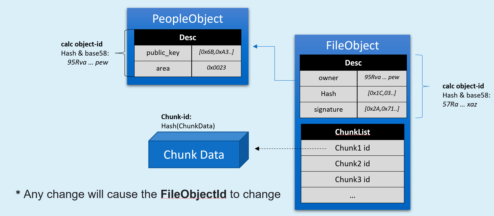

# Posting files to OOD
Now that we have our own OOD and our own cryptographic identity, we are all set and ready to construct a valid CYFS Object URL by simply uploading the file to the OOD.

This step is done using the cyfs-tool we used earlier:
```
Execute the command `npm i -g cyfs-tool` to install the beta version of the cyfs-tool tool
```

## Uploading files via cyfs-runtime
Now you have an activated cyfs-runtime on your development machine (with the CYFS browser installed on this machine ([download page](. /Download.md)), and it is activated, you can upload files from your machine to your OOD via cyfs-runtime.
```
Use the command `cyfs upload <file_path>`, to upload the files pointed to by the local <file_path> to the OOD.
```
This command also has two optional arguments, both of which can be omitted in most cases. The two arguments are as follows.
-e <runtime|ood>, specifying which protocol stack the cyfs tool uses locally, the default is ``runtime`''
-t <runtime|ood>, specifies which protocol stack to upload the file to, default is `ood`.
  
After a few moments, the file is uploaded successfully. At this point the tool will return a link starting with `cyfs://o`, which is what I want!    
This link, which we also call the NamedObject Link, is unique across the network and will point to the same file you just uploaded.

## Add a file that already exists on OOD directly
If the file to be uploaded is large and already saved on the OOD, we can also choose to add the file directly to the CYFS network on the OOD.

Log in to OOD via SSH, with cyfs-tool also installed on OOD, and use the command `cyfs upload <file_path> -e ood`, to add the file pointed to by the local <file_path> to OOD.
- The -e ood option indicates that the cyfs tool will use the local OOD stack, which cannot be omitted at this point

Executing this command on OOD, you can observe that the command is executed much faster because there is less upload step. After the command is executed, a link starting with `cyfs://o` will also be generated.

**Note**: This command is executed on OOD as `*tag*` instead of `*upload*`, so if you delete the local files on OOD, the link will be disabled. When executed on the machine where cyfs-runtime is located, it is "*upload*", and you can delete the local files on the runtime machine after the upload is completed. Files uploaded via the cyfs upload command are saved in the /cyfs/data/ directory of OOD by default.

# Downloading files
Once the file is uploaded successfully, the generated object link is accessible to others. You can open it directly in the CYFS browser to view it, or you can download it via `cyfs-tool`.

Using the command `cyfs get {cyfs://} -s <save_path>`, the file can be downloaded locally via the cyfs-runtime stack
- If you want to download using the OOD stack, execute this command on the OOD with the -e ood parameter.

Storage logic.
- If save_path is a file path that does not exist.
  - If the cyfs link points to a directory, all the contents of the directory will be downloaded to the save_path directory
  - If the cyfs link points to a file, or a subfile in a directory, the file will be downloaded to the save_path file
  - If the cyfs link is to a subdirectory, the contents of the subdirectory will be downloaded to the save_path directory
- If save_path is a directory that already exists.
  - If the cyfs link points to a directory, all the contents of the directory will be downloaded to the save_path/{objectid} directory
  - If the cyfs link points to a file, the file will be downloaded to save_path/{fileid.file} file
  - If the cyfs link is pointing to a subdirectory, or subfile, the content pointed to will be downloaded to save_path/{subdirectory name or subfile name}

When downloading on the runtime, this data is not cached on the OOD corresponding to this runtime because it is a point-to-point transfer.

# Introduction to the GET principle
Let's do a little more extended reading on the principles of the work we just completed to learn more about some of the important underlying concepts of CYFS.

## NamedObject and NamedData
Files are typically unstructured data, but in CYFS we represent them by a structured NamedObject, which is called a FileObject and is one of the standard objects in CYFS. 
The ObjectId created from the local file is 57Ra.... .xaz, the structure of the FileObject is as follows.


As shown above, FileObject is a NamedObject and its Desc section contains the file's Hash, so any changes to the file will cause the FileObject's ObjectId to change. Also there is ChunkList field in FileObject, with ChunkId which is the Hash of the chunked data, pointing to the chunked file content. chunkList does not enter into the Desc calculation of FileObject, so we reserve the freedom for the constructor of FileObject on how to better slice the original file.

These sliced, unstructured data, identified by a hash with length, we call ChunkData, also known as NamedData.   

In CYFS, the protocols and components that handle the transfer/preservation of NamedObject are called NON (NamedObjectNetwork) and the protocols and components that handle the transfer/preservation of NamedData are called NDN (NamedDataNetwork). If you have some experience developing network protocols, you may have heard the term NDN. Yes, we didn't invent the term NDN, it's a theory with some history, and we inherited a lot of the academic work on NDN with some refinements. cyfs:// is most likely the first commercial application protocol implementation based on NDN theory. It is clearly beyond the boundaries of this paper to explain NDN theory. If you are interested, you can have a deeper understanding of NDN-related theories and can better understand the architectural design of CYFS.

## Download Process
Let's call the downloader runtime, the downloader OOD, and the resource OOD, and analyze the overall flow.
1. runtime through the CYFS Object URL, based on NON to get FileObject. 2.
2. runtime gets the ChunkData in NDN network based on ChunkId one by one through the ChunkList in FileObject.

The NON protocol is based on the NDN theory, which natively supports multi-source transmission and pays more attention to maximum bandwidth utilization and overall network load balancing. The NDN protocol is based on NDN theory and natively supports multi-source transport, placing more emphasis on maximum bandwidth utilization and overall network load balancing.

The following is a typical complete flow.
- runtime checks whether the object exists in the local cache
- runtime initiates a NamedObject query request (the following actions are not serial)
  - Querying OOD for the existence of a NamedObject
  - OOD queries MetaChain for the existence of the NamedObject
  - OOD queries the previous hop device for the existence of the NamedObject based on the Reference information in get
- OOD queries the configuration of Object's Owner Zone through MetaChain
- OOD connects to NamedObject's OOD or NamedObject' Cache to query NamedObject through Zone configuration

After getting the ChunkId, runtime calls BDT's Channel interface (NDN semantic interface) to request the Chunk
- For the first, small Chunk, it will get it directly from the associated OOD
- For the second Chunk, it will try to get it from the previous hop (Reference OOD)
- BDT will try to do multi-source lookup and fountain code based multi-source download based on the Context information of the application layer
- The router can identify the Chunk request packets sent by BDT, intercept and forward them to further optimize the overall load of the network

# Summary
Congratulations! By this point you've completed the first phase of CYFS! Although the content is very simple, you have practiced one of the important fundamental rights that Web3 brings to people through CYFS Object URL: "Everyone has the right to save and publish content on the Internet". This Link can always be opened as long as the Owner of the CYFS Object URL wants it to be, and from the user's point of view, it is a trusted URL that points to content that will not be tampered with.


