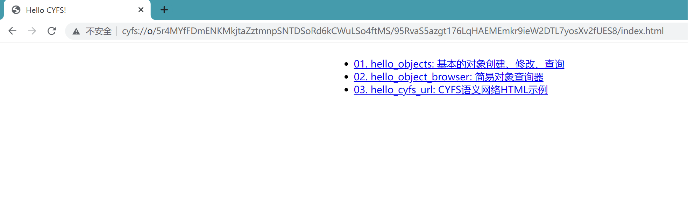
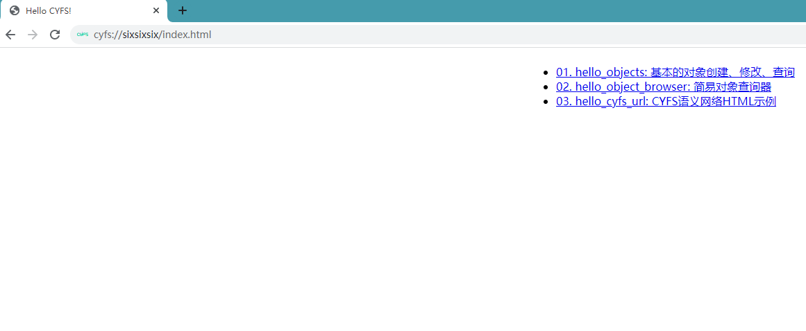
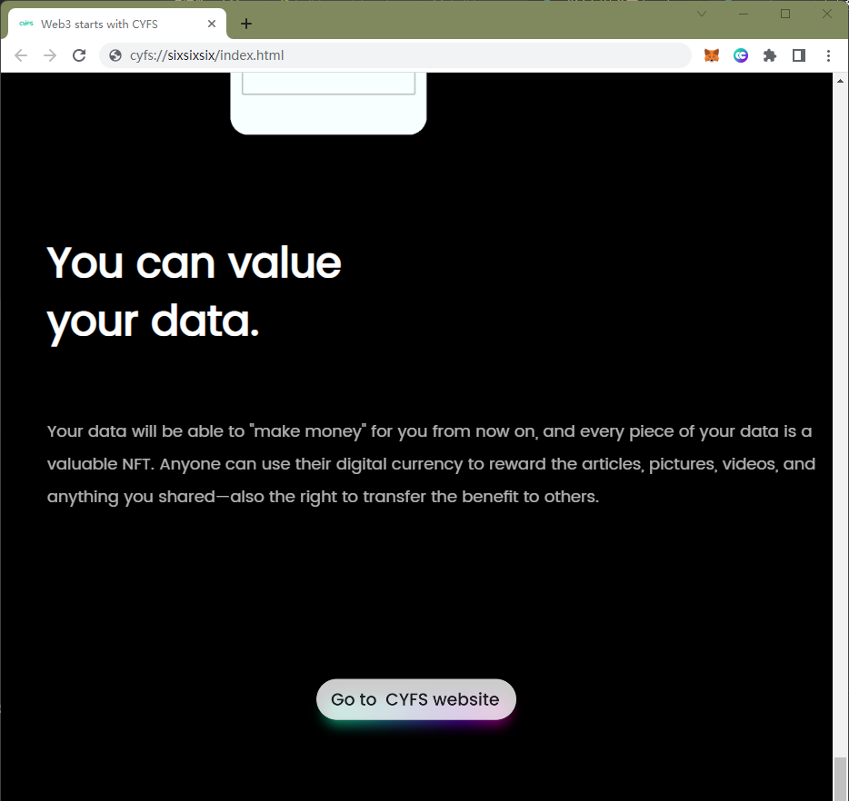

# Publish your own static website

## Publish a static website using the upload command
Prepare a static website www, and publish all files in the www directory to ood, use the command `cyfs upload www -t ood`
```powershell
PS E:\> cyfs upload www -t ood
[info],[2022-06-14 23:19:23.831],<>,cyfs-sdk version 1.0-nightly (2022-06-13), index.js:49298
[info],[2022-06-14 23:19:24.496],<>,[cyfs], tools directory: C:\Users\Bucky\AppData\Roaming\npm\node_modules\cyfs-tool-nightly, cyfs. js:2538
[info],[2022-06-14 23:19:54.137],<>,will get trans task state: http://127.0.0.1:1322/trans/task/state [object Object], index.js: 71829

......

After command is complete, the local `www` directory has been uploaded to OOD and the only unique O-Link have been generated, you can use the cyfs browser to open cyfs://o/5r4MYfFDmENKMkjtaZztmnpSNTDSoRd6kCWuLSo4ftMS/95RvaS5azgt176LqHAEMEmkr9ieW2DTL7yosXv2fUES8/{directory internal path} to access the corresponding file


## Open this static website with cyfs browser
Use the address of the url in the previous step, plus the `index.html` website entry file placed under the www before, and copy and paste the final URL such as `cyfs://o/5r4MYfFDmENKMkjtaZztmnpSNTDSoRd6kCWuLSo4ftMS/95RvaS5azgt176LqHAEMEmkr9ieW2DTL7yosXv2fUES8/index.html` into the CYFS browser The address bar, the effect is as follows:


## To buy a name, use cyfs-meta-client
If there is no rust environment, configure and install the rust environment, compile the `CYFS/src/tools/cyfs-meta-client` tool, and get an executable file cyfs-meta-client. For subsequent convenience, you can copy this file to your In the `bin` directory of the system, ***The following steps are all in `powershell` on windows 10, linux/mac users compile and install cyfs-meta-client accordingly***
```powershell
$Env:CHANNEL = 'nightly' # nightly beta confirm your previous ood, the browser's channel, if you don't specify an environment variable, the default is nightly
cd CYFS/src
cargo build -p cyfs-meta-client --release

### Get account balance, such as owner_id above `5r4MYfFDmENKMkjtaZztmnpSNTDSoRd6kCWuLSo4ftMS`, make sure there is enough balance, default 100 ECC
# Receipt of test coins 1. From wallet recharge and transfer to reward to the designated device of the object browser, 2. The faucet operation channel obtains the token

### 0. Check account balance
.\cyfs-meta-client.exe getbalance 5r4MYfFDmENKMkjtaZztmnpSNTDSoRd6kCWuLSo4ftMS
## Output like `account 5r4MYfFDmENKMkjtaZztmnpSNTDSoRd6kCWuLSo4ftMS balance 7999647900`

### The following 1 2 steps use the CyberChat to bind your own DID. If you need to use the second method of developer mode, please refer to `1. Create your own DID file.md` in `Use CYFS TOOL to bind DID` to ensure that .cyfs_profile\People key pair file is local
#### 1. `cyfs import-people` import people file, the default path is `C:\Users\Bucky\.cyfs_profile`, use Cyber ​​Chat to scan the QR code in the command line to complete the import
cyfs import-people

#### 2. People and devices are on the chain, if they have been on the chain before, skip this step
.\cyfs-meta-client.exe putdesc -c C:\Users\Bucky\.cyfs_profile\People
.\cyfs-meta-client.exe putdesc -c C:\cyfs\etc\desc\device
## Output like `create/update desc 5hLXAcPC78hJVrQ95djNBJzv75p3ACUAHTB2xtRvz6bZ success, txhash 8YCfQUGt6wbV7kb7iRXhHGiJf8DXnyktaFaNTQWTYg3G`

### 3. Check the deivce on-chain status, txhash txhash in the previous step, return ret: 0 means success
.\cyfs-meta-client.exe getreceipt 8YCfQUGt6wbV7kb7iRXhHGiJf8DXnyktaFaNTQWTYg3G

### 4. Buy name, 1 Qiu = 10^-18 ECC
.\cyfs-meta-client.exe bidname sixsixsix -c C:\Users\Bucky\.cyfs_profile\People -o 95RvaS5azgt176LqHAEMEmkr9ieW2DTL7yosXv2fUES8 500000 500000

### 5. Output like `bid name sixsixsix success, txhash 8YCfQUGm7Aiz2dM3BFKdU1q8fbX6moo4GG6LGzYA8Row`
# View bidname's tx hash
.\cyfs-meta-client.exe getreceipt 8YCfQUGm7Aiz2dM3BFKdU1q8fbX6moo4GG6LGzYA8Row

````

## Using cyfs-meta-client, bind the name to the root of the website
### 1. object dec_id set name link
.\cyfs-meta-client.exe namelink sixsixsix -c C:\Users\Bucky\.cyfs_profile\People 95RvaS5azgt176LqHAEMEmkr9ieW2DTL7yosXv2fUES8 --type obj

### 2. Get the object id after the name is bound successfully
.\cyfs-meta-client.exe getname sixsixsix

## Reopen the static site with the newly purchased name
Visit `cyfs://sixsixsix/index.html`, the effect is as follows:

