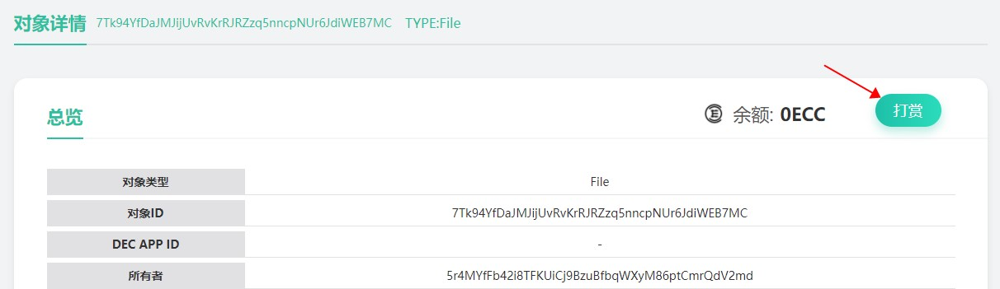
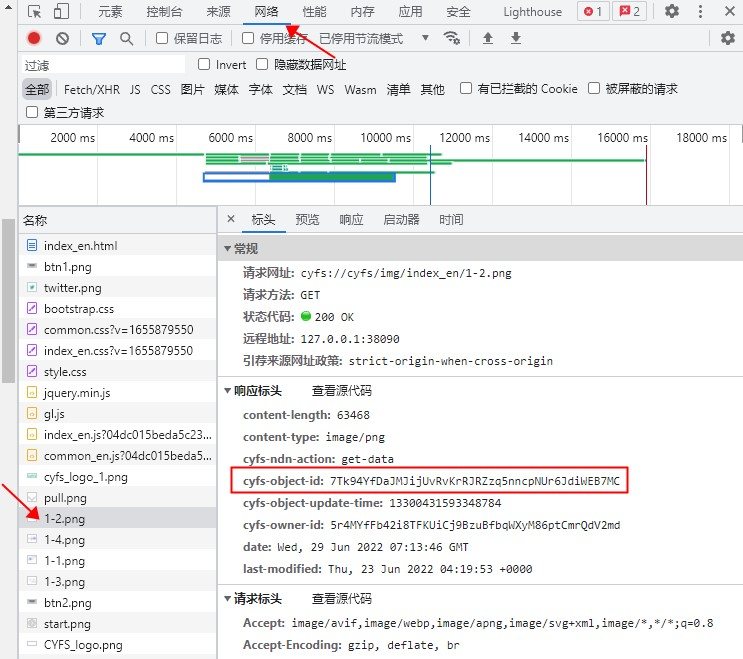

# Give a friend a little credit
With the above example, you have quickly understood the basic features of CYFS Object Link: it gives anyone equal rights to save and publish data on the Internet and is verifiable, allowing the construction of a network of trusted data based on Object Link. Here we will demonstrate another important feature of Object Link: Data is account.

There are two ways to make a reward.
1. if you are a bundled user, you can reward directly by scanning the code with SuperSend
   > Enter any of the above cyfs:// ObjectId's into the search box on the CYFS browser home page, and you will be redirected to the Object page of the Object Browser.
   > 
   > Click on the Reward button in the top right corner of the Object page, use SuperSend to scan the QR code on the screen, and enter the reward amount and account password in SuperSend to reward
2. If you created your identity using the CYFS TOOL tool, you will need to use the cyfs-meta-client tool (available later) to reward the data
   > First download the cyfs-meta-client tool for the corresponding platform and channel and type in the command line
   > ```shell
   > cyfs-meta-client transfer -f <people files> -t <objectid> <balance>
   > ```
   > and the reward will be credited. The parameters are described as follows.
   > - `-f <people files>` Enter the rewarder's people key pair, which is the two files `people.desc/sec` generated previously using the `cyfs desc` command. Here you need to keep the file names the same and the extensions the same, and enter the path to the file without the extensions here. The amount of the reward will be deducted from this account
   > - `-t <objectid>` Enter the ID of the object to be rewarded
   > - `- <balance>` Enter the amount to be rewarded in Qiu. 1 DMC = 10^8 Qiu

After the reward, wait a short time (about 30 seconds for the reward transaction to be uploaded and for the spv to process it) and refresh the object details page again to see that the balance of the object has changed and that the transaction just transferred can be seen in the transaction list


# Get the ObjectId of any data
To see the ObjectId of any element in the CYFS browser, press F11 to open the developer tools, switch to the web tab and visit or refresh a CYFS page.

In the list of requests on the right, view the response header for any cyfs link. The value of its cyfs-object-id field is its corresponding ObjectId

# Withdrawals and transfer of earnings rights
**NOTE: Only the owner of the object's right to the proceeds can withdraw the balance on the object's account**

As with bounties, there are two ways to withdraw funds.
1. if you are using the identity tied to SuperSend, you can withdraw via SuperSend
   > As with bounties, use the object browser page of the cyfs browser to view this object
   > 
   > If you are the owner of the right to receive this object, a "Withdraw" button will appear on the viewing page of this object. Click on the withdraw button, scan the QR code on the screen with the hyperdrive and follow the instructions to withdraw to your account.
2. If you have created your identity using the CYFS TOOL tool, you will need to use the cyfs-meta-client tool (available later) to withdraw your money, which is a more complicated process
   > - If you have not previously uplinked the object, you will not be able to withdraw to this object. If you have previously uploaded this object, you can skip steps 1 and 2 and start directly with step 3
   > 1. Save the object information locally: Use the command `cyfs dump <objectid>` to save the object meta information locally. The saved file name is `<objectid>.obj`.
   > 2. Upload the object information: Use the command `cyfs-meta-client putdesc -c <caller files> -d <obj file>` to upload the object just saved. The parameters are described as follows.
   > > - `-c <caller files>` The key pair of the uploader. Same rules as for the PEOPLE key pair when making a reward. Just enter the withdrawer'speople key pair here
   > > - `-d <obj file>` The object information file to upload. Here enter the path to the object file you just saved
   > 3. Withdraw: use the command `cyfs-meta-client withdraw -c <caller files> <objectid> <value>`, to withdraw the specified amount to the caller's account
   > > - `-c <caller files>` The key pair of the person withdrawing the money. The same rules apply as for the PEOPLE key pair when making a reward. Here you must enter the withdrawer's PEOPLE key pair
   > > - `<objectid>` The account to be credited, here the object id is entered directly
   > > - `<value>` The amount of money to be withdrawn from the account. You cannot withdraw more than the amount already in the account. The unit here is Qiu. 1 DMC = 10^8 Qiu

The default owner of the object is the Owner of the object. The current owner of the object can transfer the right to the proceeds to someone else. After the transfer, only the current owner can withdraw money from the object account. This function is not yet available

# Conclusion