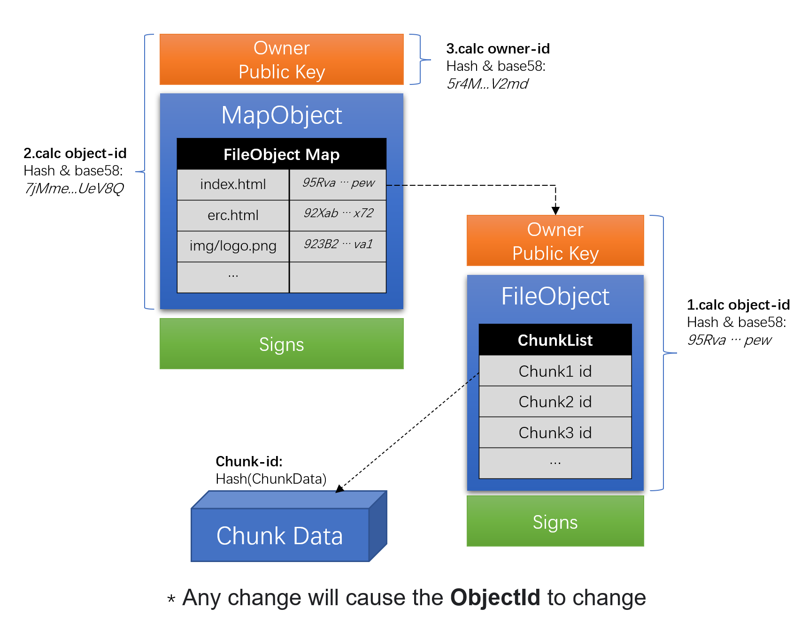

# Introduction to CYFS protocol design

The CYFS protocol is an upgrade to the HTTP protocol family, and will try to maintain the approximate semantics of HTTP.
CYFS's core process is:

> CYFS DEC App <--cyfs@http--> cyfs-rutnime <--cyfs@bdt--> gateway <--cyfs@http--> CYFS DEC Service

The cyfs@bdt protocol actually running in the network will not be directly used by the DEC App client and server. This design makes the implementation details of the cyfs@bdt protocol transparent to application developers, allowing us to have chance for improve it, and at the same time It can also reduce the learning and use threshold for developers.

The cyfs@http protocol will be used by DEC App developers, so the design should be concise and easy to understand and long-term stable.

# NamedObject design

NamedObject is structured information. Thanks to the work of predecessors, data definition methods such as json have been widely used. We can use json to define a named object of "People":

````json
{
    "name" : "liuzhicong",
    "email" : "liuzhicong@buckyos.com",
    "gender" : "male",
    "nickname" : "LZC"
}
````

In CYFS, named objects that are semantically consistent with this JSON are called normal-named- object, and such objects are `immutable objects`. CYFS requires that semantically identical named objects encode the same result. The `encode standard of named objects` is part of the CYFS named object protocol and will not be described in this article. Perform Hash calculation on the encoded result to obtain the `ObjectId` of the named object.

````
ObjectId = Hash(Encode(NamedObject))
````

Next, we add an important field public_key (using base58 encoding) to this "People" object. The people who created this People object will properly save its corresponding private key.

````json
{
    "public_key":"xxxxxx",
    "name" : "liuzhicong",
    "email" : "liuzhicong@buckyos.com",
    "gender" : "male",
    "nickname" : "LZC"
}
````

Such named objects that contain public keys are called 'Authorized-Object'. `Authorization` can be performed by means of a signature. With this design, we can add variable parts to named objects. For example, we want People's email and nickname to be modifiable, defined as follows

````json
{
    "public_key":"xxxxxx",
    "name" : "liuzhicong",
    "gender" : "male",
  
    "mut_body" : {
        "email" : "liuzhicong@buckyos.com",
        "nickname" : "LZC"
    },
    "mut_body_sign" : "xxxxxx"
}
````

The mut_body part and the mut_body_sign part will not be included when calculating the ObjectId for this authorized object.

Safe and reliable protection of private keys requires cost and effort, and it is impossible for us to make every named object a 'Authorized-Object'. `Owned-Object` is the widely used `authentication` object. Below is the design of an ArticleObject that represents an `ArticleObject` authorized object

````json
{
    "owner_id":"xxxxx",
    "title":"CYFS will be released on October 24, 2020",
    "publish_time":"2020-10-24 20:48:00",

    "mut_body" : {
        "content" : "article content details"
    },
    "desc_sign":"xxxx",
    "mut_body_sign":"xxxxx"
}
````

The content of the owner field is an ObjectId of type People. When using this ArticleObject, its Owner Object should be obtained first. Owner ObjectId can be used to verify the integrity of the Owner Object. Then use the public key in the Owner Object to verify the signature of the ArticleObject to determine that the article was published by a certain author.

Based on the above principles, a folder on a disk can be encoded into a privileged object (this process is very similar to the construction of git tree), and the encoding structure is as follows:



# GET Object(NamedObject) Get the named object

`cyfs://o[/$ownerid]/$objectid[/$innerpath][?mode=object&format=json]` (URL in this format is ObjectLink URL, or `O Link` for short)
Get the specified NamedObjecct and return it through the Http resp body. The format of the body is the specified format.
Without passing in mode, the behavior of GET will do some `Smart Recognition` based on the object-type of the requested NamedObject.

## Smart Recognition

- When GET FileObject, the FileObject itself will not be returned, but after the first Chunk reconstruction of the File is completed in cyfs-runtime, the File Content will be returned, and the Range will take effect.
- When GET DirObject/MapObject, it returns an DIR html structure by default.

## Notice

- When you enter the `O link` in the browser address bar, the behavior of opening a certain type of NamedObject will be converted into an in-app page according to the installed DEC App, such as
  `cyfs://o[/$ownerid]/$objectid` points to an ArticleObject(an AppObject). If a DEC App installed by the user registers the opening method of ArticleObject, it may be automatically converted to
  `cyfs://a/$decid/show_article.html?owner=$ownerid&objid=$objid`.
  If it points to an AppObject and the DEC App is not installed locally (the DEC APP exists), the browser will prompt to install the DEC App first. (According to our requirements, the official DEC App will be published on MetaChain, so it is easy to judge whether it exists).
- Pay attention to `Failure Flooding `: From the perspective of DEC Client, `GET NamedObject has multiple acquisition logics that can be parallelized`, and DEC Service also do the behavior. If the connection between the DEC Client and the OOD is stable, the DEC Service running on the OOD should make enough error retries. The DEC Client will retry multiplexed only when the OOD cannot be connected. This can reduce the total amount of failure retries in the network.

## Step1: CYFS DEC App (browser) <-> cyfs-runtime@local (cyfs@http)

This is the most common request, so its interface logic is a normal HTTP GET request to the local cyfs-runtime.
According to this design, when cyfs-runtime is bound to the local port 80, if the user configures `host o` as 127.0.0.1 in the HOST (or the local virtual IP bound by cyfs-runtime), it can be used directly in traditional web2.0 browsers:
`http://o/$ownerid/$objectid` can access.

Reqeust:

````
GET http://o/$ownerid/$objectid/$innerpath?mode=object&format=json HTTP/1.1
[cyfs-from:$deviceid] // If filled in, it means that the App wants to initiate a request with the specified identity
[cyfs-context-id:$contextid] //The GET in the same event of application logic should be filled in as an id as much as possible, which can be passed to the BDT to improve transmission performance
[cyfs-decid:$decid] //decid of the request app.
*Reference : $Reference //The method to let traditional browsers automatically fill in the contextid. `Two-jump` transmission involving the underlying layer
*Range: $Range // Range is valid when $objectid is FileObjectId or ChunkId.
Accept: *
````

Response:

````
HTTP/1.1 200 OK //
cyfs-body-type:bin_object | json_object | file_content //Content type in Http-Resp-Body
cyfs-object-id: $objectid
cyfs-owner: $owner
[cyfs-remote:$deviceid] //The deviceid of the returned result
[MIME:textobject] //Should MIME control be passed in on GET? There should be an optional field in the FileObject to request the default MIME type.
[Cache:] //Cache control can be used by default. For objects with MutBody, it should be set to "no cache".
````

Response Bodys: (Multi type results depending on cyfs-body-type)

````
1. Binary NamedObject
2. FileContent (ChunkData)
3. JSON format NamedObject 
````

Note that the error code and behavior of the Response should be aligned with the HTTP protocol as much as possible, so that the browser can have the correct default response. The following is the error code of cyfs-runtime

- 200 everything works
- 404 Object not found, cannot be opened

## Step2:cyfs-runtime <-> gateway (cyfs@BDT or BDT)

The BDT protocol is currently transparent to applications, so we reserve the opportunity to improve performance based on application practices. For example, a special BDT protocol message can be customized for NamedObject GET. Using HTTP@BDT Stream is currently the most stable implementation.

According to the above design, after this layer establishes the correct BDT Stream, it only needs to forward the HTTP request as it is. Because BDT has its own identity, the cyfs-from field in Req and the cyfs-remote field in Resp are deleted to reduce traffic usage.

## Step3:gateway <-> DEC Service (cyfs@http)

DEC Service should not handle GET requests for NamedObject in normal. The default behavior of gateway is to automatically perform a NamedObject lookup and return the result.
Under the default behavior, the permission control for GET NamedObject is:

- All requests in the zone are PASS. If there is no OOD in the zone, it will try to obtain it from other places. (`The ownerid in the request does not have to be equal to OOD's Owner`).
- For requests outside the zone, if the requested Object is not available on the OOD, 404 will be returned directly. If there is, judge the Owner of the Object, and return if the Owner is not the OOD's Owner. If yes, the request that meets the following conditions is PASS: from "Friend Zone" or NamedObject is Public; Valid ContextId (see Context Management for details)

DEC Service can set the GET NamedObject Handler according to the interface in the gateway part of the SDK. The basic process after setting is similar to nginx upstream, the process is as follows:

> `gateway-req->data_firewall->dec_service->data_firewall-resp->gateway`
> Before the gateway forwards the request to the DEC Service, and after the DEC Service completes the processing and generates a Response, it will go through the data firewall.

- We haven't support GET NamedObject Handler yet.

# GET Chunk(NamedData) to get named data

`cyfs://o[/$ownerid]/$chunkid`
Get the specified Chunk. The basic process is the same as GET NamedObject.In terms of permission control, if the Chunk can find the corresponding NamedObject, it will use the same permission control. If you can't find it, all request will be PASS.

- Any Chunk that is not referenced is considered to be placed in the OOD's Cache. To improve data availability in the CYFS network, Cache Data is usually accessible.

GET Chunk mode uses NDN mode for transmission. In order to improve the transmission efficiency of NDN and reduce the overall load of the network, BDT has a specially designed protocol. This protocol sends Chunks unencrypted(App MUST encrypted Chunk before transporting) to facilitate the router on the network to intervene and optimize Chunk data exchanges. If the application needs to transmit chunks in end-to-end encryption, it needs to be configured.

# GET NamedObjectList （Get objects in batches)

The design of the GET Object protocol is simple and clear, but its QA feature will consume a lot of redundant traffic when a large number of named-objects need to be acquired. Therefore, we designed a protocol for obtaining Objects in batches to optimize performance.

- Object Package
  When GET Objects by ObjectMap, and the mode is specified as object_package, a ChunkId will be returned. ChunkId corresponds to the full package file of ObjectMap. Then you can use Get Chunk to get all the Objects in the Map more efficiently. You can only return the MetaData (key-objectid) list of the ObjectMap through parameters. For extremely huge ObjectMap, you can specify the number of layers to reduce consumption. For a single-layered ObjectMap with a particularly large size, it should be exchanged after reducing the size by querying through other interfaces (such as POST).
  `cyfs://o[/$ownerid]/$obj_map_id?mode=chunk`
- Pass in the old Object Map Id and the new Object Map Id, and return the incremental part
  This is a synchronization scenario similar to Git Pull. Assuming that the Client always tracks the version of an ObjectMap on the OOD locally, then the DEC Service also has the version saved locally by the Client. At this time, the DEC Service can calculate the incremental part to improve the synchronization performance. . Details can be expanded, and application development should take full advantage of the immutable properties of most NamedObjects to optimize transmission.

REMARK: This implementation is under develop.

# GET RootState

（TODO: Need introduction of RootState）
RootState is the object file system that DECService saves on OOD, and can point to a NamedObject through a logical path (root_state_path). The NamedObject pointed to by this logical path is variable.

`cyfs://r[/$ownerid]/$decid/$root_state_path[?mode=object&format=json]` (RootState Link URL, or `R Link` for short) By design, the semantics of this URL are consistent with today's http URL semantics.

- If ownerid is not filled in, it will initiate GET RootState to the current zone.
- RootState always points to a NamedObject, and its default behavior is consistent with the Object Link corresponding to the direct GET.
- When mode=objectid, the returned body-type is empty
- There will be the current version number of RootState in Resp, you can pull the current version of RootState based on the version number
- For a group of RootState GET behaviors, a common sessionid number can be passed in the parameters, and result will be returned based on the same version of RootState

## Step1: CYFS DEC App (browser) <-> cyfs-runtime@local (cyfs@http)

Reqeust:

````
GET http://r[/$ownerid]/$decid/$root_state_path[?mode=object&format=json] HTTP/1.1
[cyfs-from:$deviceid] // If filled in, it means that the App wants to initiate a request with the specified identity
[cyfs-context-id:$contextid] //The GET in the same event of application logic should be filled in as an id as much as possible, which can be passed to the bottom layer to improve transmission performance
[cyfs-decid:$decid] //Decid of the request.
*Reference : $Reference //The method to let traditional browsers automatically fill in the contextid. Two-hop transmission involving the underlying layer
*Range: $Range // Range is valid when $objectid is FileObjectId or ChunkId.
Accept: *
````

Response:

````
HTTP/1.1 200 OK //
cyfs-body-type:bin_object | json_object | file_content | none] //Content type in body
cyfs-object-id: $objectid
cyfs-owner: $owner
cyfs-root-version: $version_id
[cyfs-remote:$deviceid] //The deviceid of the returned result
[MIME:textobject] //Should MIME control be passed in on GET? There should be an optional field in the FileObject to request the default MIME type.
[Cache:] //Cache control can be used by default. For objects with MutBody, it should be set to "no cache".
````

### Convert R Link to O Link

Based on the information in the Response, we can PIN an R Link to O Link.
`cyfs://o/$cyfs-owner/$cyfs-root-version/$root_state_path` => `cyfs://o/$cyfs-owner/$cyfs-object-id`

## Step2 cyfs-runtime <-> gateway (cyfs@BDT)

After the correct BDT Stream is established, the HTTP request is forwarded to the gateway of the target OOD as it is. Because BDT has its own identity, the cyfs-from field in Req and the cyfs-remote field in Resp are deleted to reduce traffic usage.

## Step3:gateway <-> DEC Service (cyfs@http)

The general HANDLE logic of gateway is as follows: (firewall->dec_service(upstream)), for GET RootState, if the application does not set HANLDER, the default implementation will return the response object according to the firewall configuration. In most cases, the application only needs to do the RootState permission settings: public/friends visible/private, no need to HANDLE GET RootState request(unless the app has complex permission controls to do)

It should be noted that the user's administrator authority can control the accessibility of RootState. In time, the application sets a specific RootState to be public through HANDLE, and the user can also prevent access to the RootState through firewall configuration.

Essentially, GET RootState only needs to return the ObjectID, and then the client can use GET Object to get further information as needed. But in actual implementation, it is usually done in one step.
At this time, pay attention to the configuration of the firewall for GET Object. The permission of GET RootState is enough, but the permission of GET Object is not, then only ObjectId is returned.

- TODO: Default permission table
- TODO: GET RootState request for other DEC Services of the authorized DEC Service Handle.

# GET App inner page

`cyfs://a/$decid[/$dirid]/$inner_path[?parms]` (maybe `cyfs://$decid.a/$dirid]/$inner_path[?parms]` would be better?)
Entering the DEC App inner page in the address bar will trigger the installation of the DEC App (if the DEC App is not installed), which will lead to the sharing of the DEC App inner page will trigger the installation of the DEC App.
The default logic of DEC App installation will save all the resources of the current version (dirid) to the OOD, so the inner pages of the same version of the DEC App MUST be integral. Whether the DEC App is automatically upgraded is completely controlled by the user, and the resources of the previous version will also be saved after the upgrade to facilitate rollback.

The inner page of the DEC App can use cyfs-sdk with the correct decid identity. If cyfs-sdk is used in the html of the non-DEC App inner page, cyfs-sdk can only be used with the permission of guest decid. There are many SDK interfaces that require decid identity.

# PUT Object to Cache

`cyfs://o/$ownerid/[$decid]`
It can be initiated for all devices. The basic semantics is to hope that the target device can save the NamedObject for a period of time (60 minutes by default), and the object may be used in some subsequent processes (usually the DEC process). Usually PUT Object does not fill in the target $decid, because the behavior of using O Link PUT Object will not be handled by DEC Service(put-order-independent).

The behavior of PUT Object to Cache has several characteristics

- Idempotency: You can PUT the same NamedObject multiple times without worrying about side effects
- Cacheability: After the PUT operation is successful, the GET will be successful immediately.
- Order independence: Although there is a Ref relationship between Objects, the order does not matter when PUT.

**Protocol process of PUT:**

## Step1: CYFS DEC App (browser) <-> cyfs-runtime@local (cyfs@http)

Reqeust

````
PUT http://o/$ownerid/$objectid HTTP/1.1
[cyfs-from:$deviceid] // If filled in, it means that the App wants to initiate a request with the specified identity
[cyfs-target:$deviceid] // If filled in, indicate the specific device to be reached
[cyfs-decid:$decid] //Decid of the request.
[cyfs-cache-time:$time] //The time you want to cache
(Body) is the binary code of NamedObject
````

Response

````
HTTP/1.1 200 OK //The NamedObject has been cached
[cyfs-remote:$remote-device-id]
[cyfs-cache-time:$time] //Determine the cache time
````

## Step2 cyfs-runtime <-> gateway or cyfs-runtime (cyfs@BDT)

After the correct BDT Stream is established, the HTTP request is forwarded to the target device as it is. Because BDT has its own identity, the cyfs-from field in Req and the cyfs-remote field in Resp are deleted to reduce traffic usage.

## Step3:gateway or cyfs-runtime <-> DEC Service / Named Object Cache (cyfs@http)

DEC App Set Handler is usually not allowed in cyfs-runtime. Here we discuss the case of Gateway.
The general HANDLE logic of gateway is as follows:

- PUT from within a Zone are accepted by default
- PUT from outside the Zone are denied by default

# PUT Object to RootState

`cyfs://r/$ownerid/$decid[/$dirid]/$root_state_path`
Can only be initiated to OOD. The basic semantic is to save the desired Object in this root_state_path. If the PUT is successful, the NamedObject that has just been PUT can be GET back through the corresponding Root State Link.

From current practice, this semantics is not commonly used. decid is generally difficult to open the direct writing of root_state, and the RootState of the dec service is changed transactionally through RPC Call.

REMAKR：PUT Object to RootState is unsupport in current version.

# PUT Chunk(NamedData)

`cyfs://o/$ownerid/[$chunkid]`
At present, it seems that there is no need for PUT Chunk, Chunk is actively pulled.
REMAKR：PUTChunk is unsupport in current version.

# POST Call DEC

`cyfs://r/$ownerid/$decid/$dec_name?d1=objid1&d2=objid2`
It is required to trigger the execution of a DEC process, which generally updates the RootState of the dec service.

There are two semantics:

- Request to execute dec, and return {R} after successful execution.
- Request to verify dec, and return the signature of triple {dec_name,{D},{R}} after successful verification.

**Protocol flow of POST Call DEC**

## Step1: CYFS DEC App (browser) <-> cyfs-runtime@local (cyfs@http)

Request

````
POST http://r/$ownerid/$decid/$dec_name?d1=objid1&d2=objid2 HTTP/1.1
[cyfs-from:$deviceid] // If filled in, it means that the App wants to initiate a request with the specified identity
[cyfs-decid:$decid] //Decid of the request.
[cyfs-dec-action:exeucte | verify]
````

The Body of the POST Call can carry a set of named objects of the package. But in most cases, DEC Service prepares params by itself.

Response

````
HTTP/1.1 200 OK
cyfs-dec-state: complete | prepare | running | wait_verify| failed //This dec is completed, preparing, working, waiting for verification, failed
cyfs-dec-finish : $time //dec completion time (dec will not be executed repeatedly, if it has been completed before, the previous time will be used)
cyfs-prepare : objid1,objid2,objid3 ... // if in the prepared state
````

Response Body: If the action is to execute, it will return Result ObjectIds. If it is verification, the verification will return the signature of the DEC triplet.

## Step2 cyfs-runtime <-> gateway (cyfs@BDT)

## Step3:gateway <-> DEC Service (cyfs@http)

The whole process is basically forwarding the HTTP POST Request and Response as they are, and it is also the main Handle request of the DEC Service.

## Understand the reaching of DEC consensus through an example

1. Alice Call Bob's DEC
2. The DEC result involves multiple Owners and needs to be verified
3. Bob returns an unverified result first
4. Both Bob and Alice can initiate DEC verification requests to other Owners
5. Bob and other Owners have collected enough verification results to confirm that DEC takes effect and advance the subsequent RootState change process (related to Owner).
6. If an Owner's data is lost, and it is found that there is no complete data to verify the DEC, it will actively try to rebuild {D}.
7. The advancement of the DEC consensus is not exactly the same as the BFT consensus of the blockchain, and actually allows more parallel consensus advancement.

# POST Call API

`cyfs://r/$ownerid/$decid[/$dirid]/$function_name?parm1=$parm1&parm2=$parm2`
It is generally used for querying and will not modify the RootState of dec_app. Arbitrary data can be returned, similar to HTTP POST. Relying too much on this call can lead to a single point of failure in the system(decentralization lost).
DEC Service will mainly handle a class of requests.

# Zone-Event (TODO: need more design)

- Subscribe to RootState changes via RootStatePath
- Subscribing to Object changes by ObjectId
- Subscribing to Event changes via EventName (consistent with the old era)

REMAKR：Zone-Event is unsupport in current version.

## broadcast(TODO: need more design)

- Broadcast PUT
- Broadcast GET

## Object routing

From the current design, point-to-point (source-related) encrypted logical requests do not have particularly strong routing characteristics. It is nothing more than Device->My OOD, Device->My OOD->Other OOD, OOD->OOD, Device->Other OOD these four forms, it seems that the design is so flexible.

And NDN is a source-independent plaintext unmodifiable protocol, which has certain routing characteristics. When we focus on improving NDN in the next stage, we will provide more support for routing logic in this area.
