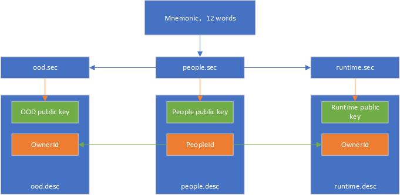

# 创建自己的身份文件
在使用CYFS系统前，必须给OOD，以及CYFS浏览器绑定身份，这里简单介绍绑定身份的几种方法
很多系统进行开发需要注册一个有效的开发者身份。

# 使用CYFS TOOL绑定身份
这种绑定方式不需要手机，也不需要扫码，只需要一台PC即可完成

使用此种方式激活后，会在控制台打印助记词。请将助记词记录下来，并妥善保管。后续可以使用该助记词，在超送中恢复身份，并继续用超送管理身份和已激活的设备

安装cyfs-tool：使用命令行`npm i -g cyfs-tool`，安装beta版本的cyfs-tool工具

## 生成身份，用于后续的手工绑定
1. 生成成套的身份
    > 使用命令`cyfs desc -s <save_path>`，生成配套的身份文件，保存在save_path目录下。如果不指定save_path，默认为~/.cyfs_profile

    > 生成的`<save_path>/people.desc`和`<save_path>/people.sec`文件是自己身份的密钥对，请妥善保存，切勿删除

    > 该命令会在控制台输出一组12个单词的助记词，请将助记词记录下来，并妥善保管
2. 绑定OOD
    > 身份生成后，复制`<save_path>/ood.desc`和`<save_path>/ood.sec`两个文件到OOD机器的`${cyfs_root}/etc/desc`下，并重命名为`device.desc`和`device.sec`
3. 绑定CYFS浏览器
    > 身份生成后，复制`<save_path>/runtime.desc`和`<save_path>/runtime.sec`两个文件到CYFS浏览器机器的`${cyfs_runtime_root}/etc/desc`下，并重命名为`device.desc`和`device.sec`

`${cyfs_root}`具体路径：
- Windows: `c:\cyfs`
- MacOS: `~/Library/cyfs`
- 其他系统: `/cyfs`

`${cyfs_runtime_root}`具体路径：
- Windows: `%appdata%/cyfs`
- Mac OS: `~/Library/Application Support/cyfs`

## 直接使用CYFS TOOL命令，绑定本机的OOD或runtime
1. 绑定OOD
   > 安装好OOD之后，确定ood-daemon进程在运行。执行`cyfs desc -a`命令，该命令会自动检查本机是否有未激活的OOD和runtime。如有，自动创建身份并进行激活

   > 该命令会在控制台输出一组12个单词的助记词，请将助记词记录下来，并妥善保管
2. 绑定runtime
   > 先安装CYFS浏览器，并启动。确保浏览器上显示扫码激活页面

   > 执行`cyfs desc -a -m "助记词组" --only-runtime`命令，这里-m参数必须输入上一步，在绑定OOD时输出的助记词组，词组必须用双引号括起来。执行完毕后，浏览器应该会自动转到主页

除了激活功能外，CYFS TOOL还提供了其他有助使用和Dec App开发的其他功能。详见
[CYFS TOOL命令说明](https://github.com/buckyos/cyfs-ts-sdk/blob/master/doc/cn/sdk%E5%91%BD%E4%BB%A4.md)

# TODO：使用CYFS 浏览器创建身份

# 使用超送绑定身份
这是我们推荐的，最为安全的方法，关键的主人秘钥保存在手机上。该方法适用于所有种类的OOD，操作简单方便

1. 安装超送（[下载页](../Download.md))，按照提示创建身份
2. 绑定OOD：先安装OOD，从官网二进制，或者自己编译的OOD均可。安装后：
   > - 如果OOD和超送在同一个局域网，可用超送的扫描绑定功能直接绑定
   > - 如果OOD和超送不在同一个局域网，先确定你的防火墙规则允许1325端口被访问，在OOD上执行`./ood-installer --bind`后，使用超送扫描终端展示的二维码进行绑定
3. 绑定runtime：安装CYFS浏览器，然后打开浏览器，使用超送扫描网页中的二维码进行绑定

## 上述文件组成的密码学身份网络说明

