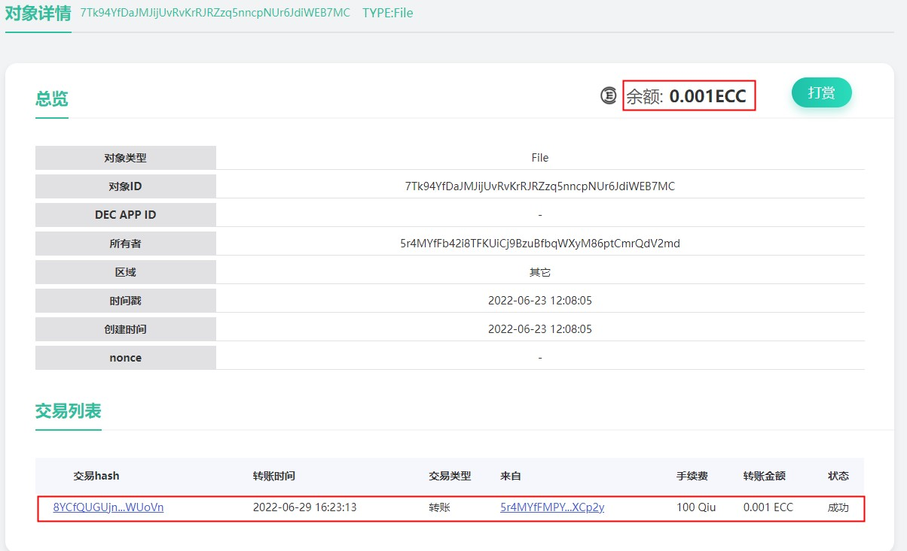
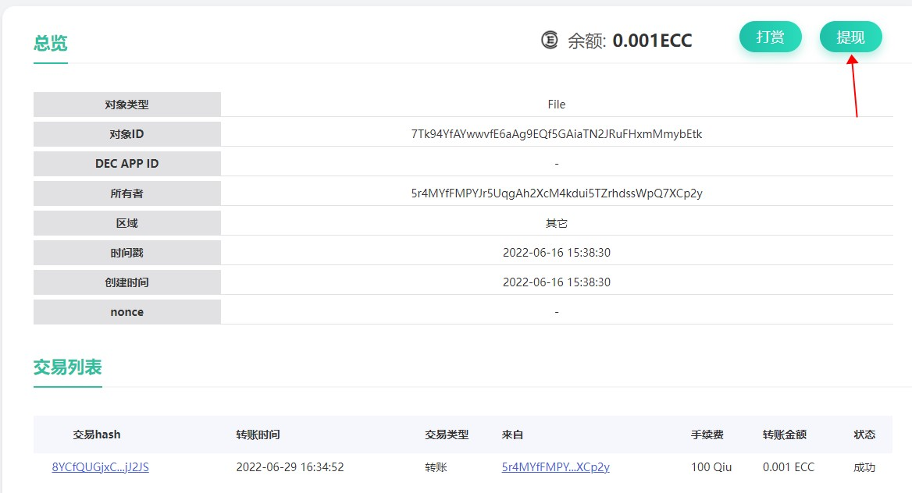

# 给朋友一点打赏吧
通过上面的例子，相信你已经快速的理解了CYFS Object Link的基本特性：给予任何人平等的，在互联网上保存数据和发布数据的权利，并且是可验证的，基于Object Link可以构建可信数据的网络 。下面我们来展示Object Link的另一个重要特性：Data is account.


打赏有两种方式：
1. 如果你是使用超送绑定的身份，可以直接用超送扫码打赏
   > 在CYFS浏览器首页的搜索框中输入上述任意cyfs://中包含的ObjectId,然后可以跳转到对象浏览器的对象页面。
   > 
   > 点击对象页面右上角的打赏按钮，使用超送扫描屏幕上的二维码，在超送中输入打赏金额和账户密码，即可打赏
2. 如果你是使用CYFS TOOL工具创建的身份，需要使用cyfs-meta-client工具(稍后提供)对数据进行打赏
   > 首先下载对应平台和通道的cyfs-meta-client工具，在命令行中输入
   > ```shell
   > cyfs-meta-client transfer -f <people files> -t <objectid> <balance>
   > ```
   > 即可打赏。各参数的说明如下：
   > - `-f <people files>` 输入打赏人的people密钥对，这个密钥对是之前使用`cyfs desc`命令生成的`people.desc/sec`两个文件。这里需要保持两个文件的文件名相同,扩展名不变，将不含扩展名部分的文件路径输入此处。打赏金额将从此账户扣除
   > - `-t <objectid>` 输入要打赏的对象ID
   > - `<balance>` 输入要打赏的金额，此处单位为Qiu。1 ECC = 10^8 Qiu

打赏后，等一小段时间（让打赏交易上链，并且spv处理到这个交易，大概30秒左右），再次刷新这个对象详情页，可以看到对象的余额发生了变化，并且交易列表中可以看到再刚刚的转账交易


TODO:对Meta Chain的目标进行一些讲解。并说明为什么现在支持的是DMC。

TODO:使用cyfs-meta-client一定要编译么？我们能预先发布么（npm也支持编译性安装）
如没有rust环境, 配置安装rust环境, 编译 `CYFS/src/tools/cyfs-meta-client` 工具, 得到一个可执行的文件cyfs-meta-client, 为了后续方便使用可以把这个文件复制到你的系统的`bin`目录下, ***以下的操作步骤都是都是在windows 10 上`powershell`, linux/mac 用户对应编译安装cyfs-meta-client***
```powershell
$Env:CHANNEL = 'nightly'  # nightly beta 确认你之前的的ood, 浏览器的channel,不指定环境变量默认是nightly
cd CYFS/src
cargo build -p cyfs-meta-client --release


```


# 得到任一数据的ObjectId
通过CYFS浏览器可以看到任一元素的ObjectId，按F11打开开发者工具，切换到网络选项卡，访问或刷新一个cyfs页面。

在右侧请求列表中，查看任意cyfs链接的响应头。它的cyfs-object-id字段的值，就是它对应的ObjectId

# 提现与收益权转移
**注意：只有对象的收益权所有人可以将对象账户上的余额提现**

和打赏相同，提现也有两种方式：
1. 如果你是使用超送绑定的身份，可以通过超送提现
   > 与打赏相同，使用cyfs浏览器的对象浏览器页面，查看这个对象
   > 
   > 如果你是这个对象的收益权所有者，这个对象的查看页面会出现一个“提现”按钮，点击提现按钮，用超送扫描屏幕上的二维码，按照超送的提示操作，即可提现到你的账户
2. 如果你是使用CYFS TOOL工具创建的身份，需要通过cyfs-meta-client工具(稍后提供)来进行提现，这个步骤会比较复杂
   > - 如果你之前没有将对象上链，则不能对这个对象提现。如果之前已经将这个对象上链，可以跳过步骤1，2，直接从步骤3开始
   > 1. 将对象信息保存到本地：使用命令`cyfs dump <objectid>`，将对象元信息保存到本地。保存的文件名为`<objectid>.obj`
   > 2. 将对象信息上链：使用命令`cyfs-meta-client putdesc -c <caller files> -d <obj file>`，将刚刚保存的对象上链。参数说明如下：
   > > - `-c <caller files>` 上传者的密钥对。与打赏时的people密钥对规则相同。这里输入提现者的people密钥对即可
   > > - `-d <obj file>`要上传的对象信息文件。这里输入刚刚保存的对象文件路径
   > 3. 提现：使用命令`cyfs-meta-client withdraw -c <caller files> <objectid> <value>`, 将指定金额提现到caller账户
   > > - `-c <caller files>` 提现者的密钥对。与打赏时的people密钥对规则相同。这里必须输入提现者的people密钥对
   > > - `<objectid>` 要提现的账户，这里直接填写对象Id
   > > - `<value>`要从账户中提现多少金额。不可以超过账户中的已有金额。此处单位为Qiu。1 ECC = 10^8 Qiu

对象的默认收益权所有者(收益人)是对象的Owner，对象的当前收益人可以将收益权转移给其他人。收益权转移后，只有当前的收益人可以从对象账户提现。TODO:该功能暂未开放
简单的表格，说明MetaChain对 数据产权 的支持。

### 获取账户account余额, 如上面的owner_id `5r4MYfFDmENKMkjtaZztmnpSNTDSoRd6kCWuLSo4ftMS`, 确保有足够的余额, 默认100 ECC
# 测试币领取 1. 从钱包充值转账到给对象浏览器指定设备打赏, 2. 水龙头faucet 运营渠道获取token

### 0. 检查账户余额
.\cyfs-meta-client.exe getbalance 5r4MYfFDmENKMkjtaZztmnpSNTDSoRd6kCWuLSo4ftMS
## 输出如 `account 5r4MYfFDmENKMkjtaZztmnpSNTDSoRd6kCWuLSo4ftMS balance 7999647900`

### 下面 1 2 步骤 使用超送绑定自己的身份, 如果需要使用开发者模式第二种方式 参考`1.创建自己的身份文件.md`里面的`使用CYFS TOOL绑定身份`，保证.cyfs_profile\People密钥对文件在本地
#### 1. `cyfs import-people` 导入people文件, 默认路径`C:\Users\Bucky\.cyfs_profile`, 用Cyber Chat 扫描命令行中的二维码完成导入
cyfs import-people

#### 2. people和 device上链, 如果之前上链过，则跳过这一步
.\cyfs-meta-client.exe putdesc -c  C:\Users\Bucky\.cyfs_profile\People
.\cyfs-meta-client.exe putdesc -c C:\cyfs\etc\desc\device
## 输出如 `create/update desc 5hLXAcPC78hJVrQ95djNBJzv75p3ACUAHTB2xtRvz6bZ success, txhash 8YCfQUGt6wbV7kb7iRXhHGiJf8DXnyktaFaNTQWTYg3G`

### 3. 查看deivce上链状态, txhash 上一步中的txhash, 返回ret: 0 表示成功
.\cyfs-meta-client.exe getreceipt 8YCfQUGt6wbV7kb7iRXhHGiJf8DXnyktaFaNTQWTYg3G


# 通过MetaChain查询Zone信息，并理解寻地址（为什么cyfs不需要TLS）


# 结语
通过上述流程，相信你已经感觉到了一点不一样的东西了。
对比传统的http协议，我们在这里得到了什么新东西？