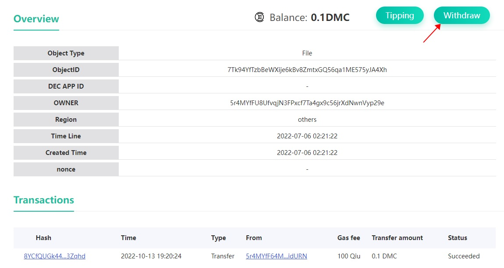

# 给内容一点打赏：理解数据产权
通过上面的例子，相信你已经快速的理解了CYFS Object Link的基本特性：给予任何人平等的，在互联网上保存数据和发布内容的权利，并且是可验证的，基于Object Link可以构建可信数据的网络 。下面我们来展示CYFS Object Link的另一个重要特性：Data is account.这个特性将赋予每个人“基于自己的内容获得直接收入”的权利。

# 给任意NamedObject打赏

给NamedObject打赏有两种方式：
1. 如果你是使用CyberChat绑定的身份，可以直接用CyberChat扫码打赏
   > 在CYFS浏览器首页的搜索框中输入上述任意cyfs://中包含的ObjectId,然后可以跳转到对象浏览器的对象页面。
   > 
   > 点击对象页面右上角的打赏按钮，使用超送扫描屏幕上的二维码，在超送中输入打赏金额和账户密码，即可打赏
2. 如果你是使用CYFS TOOL工具创建的身份，可以使用CYFS TOOL的meta命令对数据进行打赏，或将助记词导入到超送后，使用超送进行打赏
   > 在命令行中输入
   > ```shell
   > cyfs meta transfer -f <people files> -t <objectid> <balance>
   > ```
   > 即可打赏。各参数的说明如下：
   > - `-f <people files>` 输入打赏人的people密钥对，这个密钥对是之前使用`cyfs desc`命令生成的`people.desc/sec`两个文件。这里需要保持两个文件的文件名相同,扩展名不变，将不含扩展名部分的文件路径输入此处。打赏金额将从此账户扣除
   > - `-t <objectid>` 输入要打赏的对象ID
   > - `<balance>` 输入要打赏的金额，此处单位为Qiu。1 DMC = 10^8 Qiu

如果你是使用CYFS TOOL工具直接激活了OOD和runtime，那么也能将助记词导入到CyberChat后，使用CyberChat进行打赏。

打赏后，等一小段时间（让打赏交易上链，并且spv处理到这个交易，大概30秒左右），再次刷新这个对象详情页，可以看到对象的余额发生了变化，并且交易列表中可以看到再刚刚的转账交易


CYFS TOOL Meta命令详见[CYFS TOOL Meta 命令](https://github.com/buckyos/cyfs-ts-sdk/blob/beta/doc/cn/CYFS-Tool-Meta%E5%91%BD%E4%BB%A4.md)

回忆之前提过的MetaChain的目标，我们希望用户能在MetaChain上使用所有主流的数据资产。这意味着NamedObject的余额可以是各种不同类型的货币。因此我们称这个特性为"Data is account"。目前大部人对区块链技术的关注点通常在数字资产上，但我们认为，深刻理解区块链开户成本为零，可给万物开户的特性，才能真正理解价值互联网。

# 在CYFS浏览器中得到任一元素的ObjectId
通过CYFS浏览器可以看到任一元素的ObjectId，按F11打开开发者工具，切换到网络选项卡，访问或刷新一个cyfs页面。

在右侧请求列表中，查看任意cyfs链接的响应头。它的cyfs-object-id字段的值，就是它对应的ObjectId。


# 提现与收益权转移
**注意：只有对象的收益权所有人可以将对象账户上的余额提现**

和打赏相同，提现也有两种方式：
1. 如果你是使用超送绑定的身份，可以通过超送提现
   > 与打赏相同，使用cyfs浏览器的对象浏览器页面，查看这个对象
   > 
   > 如果你是这个对象的收益权所有者，这个对象的查看页面会出现一个“提现”按钮，点击提现按钮，用超送扫描屏幕上的二维码，按照超送的提示操作，即可提现到你的账户
2. 如果你是使用CYFS TOOL工具创建的身份，需要通过cyfs meta命令来进行提现，这个步骤会比较复杂
   > - 如果你之前没有将对象上链，则不能对这个对象提现。如果之前已经将这个对象上链，可以跳过步骤1，2，直接从步骤3开始
   > 1. 将对象信息保存到本地：使用命令`cyfs dump <objectid>`，将对象元信息保存到本地。保存的文件名为`<objectid>.obj`
   > 2. 将对象信息上链：使用命令`cyfs meta putdesc -c <caller files> -d <obj file>`，将刚刚保存的对象上链。参数说明如下：
   > > - `-c <caller files>` 上传者的密钥对。与打赏时的people密钥对规则相同。这里输入提现者的people密钥对即可
   > > - `-d <obj file>`要上传的对象信息文件。这里输入刚刚保存的对象文件路径
   > 3. 提现：使用命令`cyfs meta withdraw -c <caller files> <objectid> <value>`, 将指定金额提现到caller账户
   > > - `-c <caller files>` 提现者的密钥对。与打赏时的people密钥对规则相同。这里必须输入提现者的people密钥对
   > > - `<objectid>` 要提现的账户，这里直接填写对象Id
   > > - `<value>`要从账户中提现多少金额。不可以超过账户中的已有金额。此处单位为Qiu。1 DMC = 10^8 Qiu

对象的默认收益权所有者(收益人)是对象的Owner，对象的当前收益人可以将收益权转移给其他人。收益权转移后，只有当前的收益人可以从对象账户提现。

**注意**: 收益权转移功能暂时不能用SDK工具或CYFS浏览器完成，需要手工构造TX，完整的数字产权管理工具我们正在开发，敬请期待。

## MetaChain对数据产权支持说明
```
打赏：Transfer TX，打赏实质就是一种转账，与转账交易相同。在CYFS体系中，任何对象Id都可以作为账户地址使用
提现: Withdraw TX，有权对象可以发起提现交易，从以自己为Owner的对象Id账户上，提现到自己的账户。因为有主对象没有自己的公钥，无法动用自己账户上的资产
Holder转移: UpdateName Tx，名字的拥有者，可以通过UpdateName交易，将所有权转移给另一个账户。这个交易也被用来更换名字的绑定信息
Holder基于一口价转移：该合约尚未实现，暂时没有对应的交易类型。将在后续版本中提供
Holder设置对象进入拍卖状态：AuctionName Tx，名字的拥有者，可以通过发起一个拍卖交易，将自己的名字再次投入拍卖流程，此时可以重新设定出价
进行一次出价：BidName Tx，任何人都可以通过发起一个竞标交易，对自己想要的名字进行一次出价。在拍卖期结束后，会根据一定的规则，
Holder结束对象的出售状态：CancelAuctionName Tx, 对象的所有者可以发起一个拍卖取消交易，取消正在拍卖的名字
```
# NamedObject与NFT
从MetaChain对NamedObject的数据产权的支持可以看到，所有的NamedObject基本都符合NFT的定义，在CYFS网络中，所有的数据为了实现确权，都必须是NamedObject。因此，在CYFS生态中，所有的数据几乎都是NFT：小到即时聊天里的一句问候，大到一篇重要的论文。和现有基于智能合约的NFT不同的是，CYFS的NamedObject是真实的“那个数据”，比如之前所谓的第一条tweet曾经以NFT的形势卖出过天价，但我们都知道“那个以太坊上的NFT和第一条tweet的关系，是靠这条tweet的作者承认的”，如果tweet系统关闭，那么这个NFT的本体就消失了。如果tweet是基于CYFS开发的去中心应用（是的，今天已经可做到了），那么这第一条tweet一定是一个NamedObject，可以真正的拥有。   

我们相信，所有数据天然都是NFT带来的观念上的改变，最终会深刻的反映到产品设计中，请以此观念为基础构思未来的Web3应用吧。

# 结语
通过上述流程，相信你已经感觉到了一点不一样的东西了。CYFS的NamedObject实现了“Data is account”的理念，从协议层保障了“每个人都能通过自己创建的内容获得直接收入”的权利。
