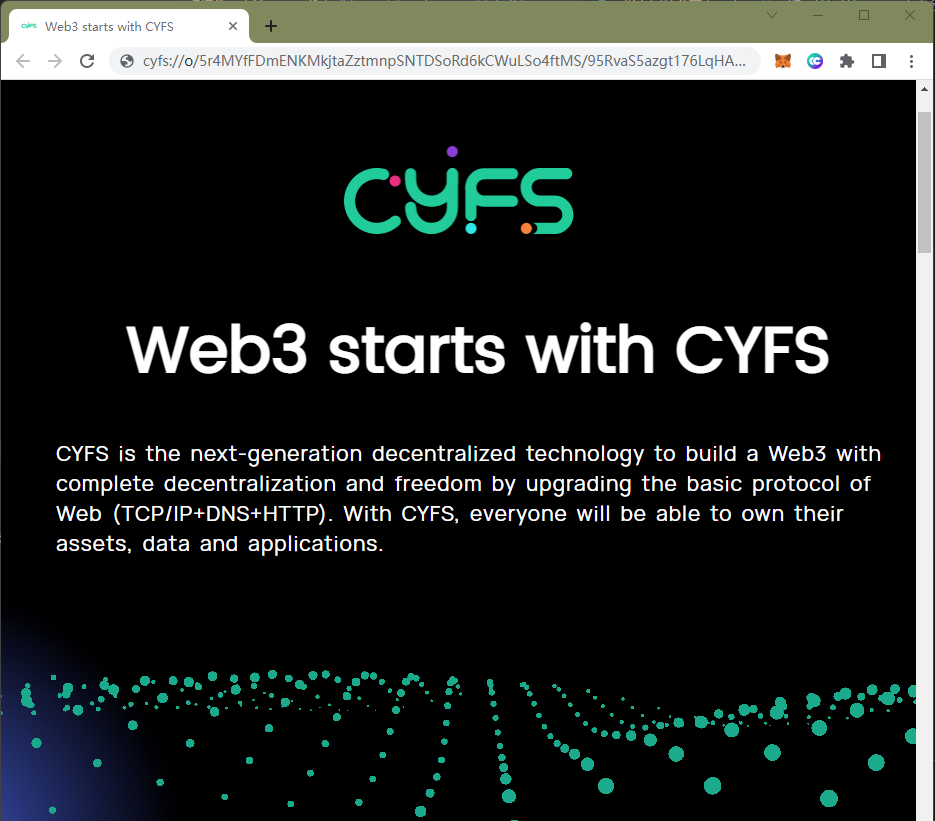
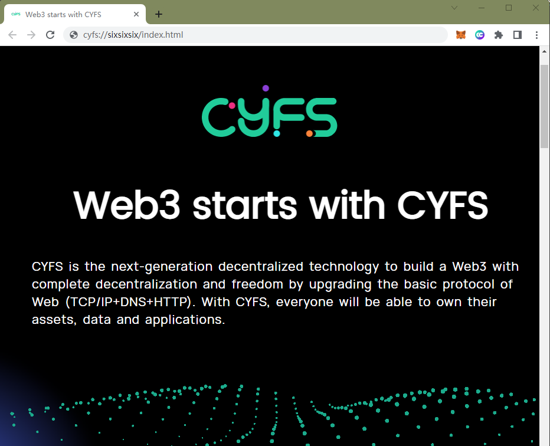

# 发布自己的静态网站

有了上述功能我们能进一步构建一个传统的Web网站么？当然可以了，但会非常麻烦。。。
为了解决这个问题，CYFS提供了和File对等的另一种基础的Named Object: DirObject,可以把一个目录整体的上传。其Named Object 的构建方法如下：


## 使用upload命令发布静态网站
准备一个静态网站www, 并且把www目录下的所有文件都发布到ood上, 使用命令`cyfs upload www -t ood`
```powershell
PS E:\> cyfs upload www -t ood
[info],[2022-06-14 23:19:23.831],<>,cyfs-sdk version 1.0-nightly (2022-06-13), index.js:49298
[info],[2022-06-14 23:19:24.496],<>,[cyfs], 工具目录： C:\Users\Bucky\AppData\Roaming\npm\node_modules\cyfs-tool-nightly, cyfs.js:2538
...
[info],[2022-06-14 23:19:54.137],<>,will get trans task state:  http://127.0.0.1:1322/trans/task/state [object Object], index.js:71829
```

命令执行完成，本地的www目录已经被上传到OOD并产生了 Web3.0的唯一连接。
可用cyfs浏览器打开cyfs://o/5r4MYfFDmENKMkjtaZztmnpSNTDSoRd6kCWuLSo4ftMS/95RvaS5azgt176LqHAEMEmkr9ieW2DTL7yosXv2fUES8/{目录内部路径} 访问对应文件


## 用cyfs浏览器打开这个静态网站
用上一步的url的地址, 加上之前的www下放置有`index.html` 网站入口文件, 最终URL的如`cyfs://o/5r4MYfFDmENKMkjtaZztmnpSNTDSoRd6kCWuLSo4ftMS/95RvaS5azgt176LqHAEMEmkr9ieW2DTL7yosXv2fUES8/index.html` 复制粘贴到CYFS浏览器地址栏, 效果如下:


## 购买一个名字，并建立链接
Meta Chain起到的是DNS的作用。DNS是旧Web必然中心化的核心问题。（稍微展开）

基于智能合约实现DNS并不是特别复杂的工作，ETH上最早的几个完整智能合约里就有做名字服务的。就是尽管现在已经有了不少比较有影响力的域名生态，我们还是要自己搞一套。在正式网是我们会慎重的考虑生态因素，找到利益的最大公约数。


### 4. 购买名字, 1 Qiu = 10^-18 ECC
.\cyfs-meta-client.exe bidname sixsixsix -c  C:\Users\Bucky\.cyfs_profile\People  -o 95RvaS5azgt176LqHAEMEmkr9ieW2DTL7yosXv2fUES8 500000 500000

### 5. 输出如 `bid name sixsixsix success, txhash 8YCfQUGm7Aiz2dM3BFKdU1q8fbX6moo4GG6LGzYA8Row`


# 查看 bidname的tx hash
.\cyfs-meta-client.exe getreceipt 8YCfQUGm7Aiz2dM3BFKdU1q8fbX6moo4GG6LGzYA8Row


### 1. object dec_id 设置名字链接
.\cyfs-meta-client.exe namelink sixsixsix -c  C:\Users\Bucky\.cyfs_profile\People 95RvaS5azgt176LqHAEMEmkr9ieW2DTL7yosXv2fUES8  --type obj

### 2. 获取名字绑定成功后的object id
.\cyfs-meta-client.exe getname sixsixsix

## 使用新购买的名字，重新打开静态网站
访问 `cyfs://sixsixsix/index.html`，效果如下:



# 在名字的帮助下，我们实际上实现了动态的cyfs://，但不同的时，所有有效的记录一定是域名拥有者产生的，并且其修改记录是可以完全跟踪的
历史版本也总是可以访问(TODO:浏览器里有对名字的历史查询提供支持么？)

# 结语
我们现在得到了什么？
打赏总是适用的
下一个系列，你将看到从这些基础知识延展出来的Web3 DApp