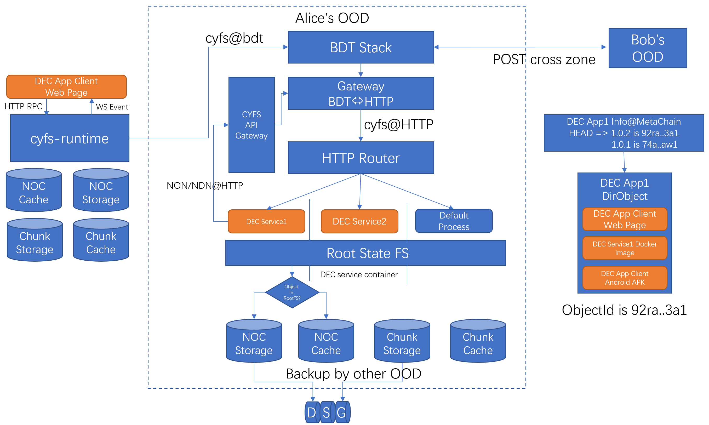

# NamedObject 容器

在《Hello CYFS》系列教程里，你已经了解了 NamedObject 和 NamedData 的基础定义，并且发现 FileObject 拥有一个 ChunkList,DirObject 和 ZIP 格式类似，在其 Desc 中保存一个 Map 来引用 FileObjectId.Map 的 Key 是 String 类型，代表内部路径，Value 是 ObjectId,指向引用的 FileObject。在 DirObject 的设计下，其包含的任何文件的改变，都会导致 FileObjectId 改变，最后导致 DirObjectId 的改变。

因此，我们即可用`cyfs://o/$owner_id/$file_obj_id`，也可用`cyfs://o/$owner_id/$dir_object_id/$inner_path` 来引用同一个文件。其验证逻辑的不同在于第二个 Link 不但会验证 FileObject 的内容，还会验证 FileObject 是不属于 DirObject。这与今天区块链经常讨论的：“一个交易是否上链”有着等价的内核，所谓交易上链，就是判断交易是否保存在一个区块中，而这个区块，最终必须保存在一个通过共识算法维护的，只允许 Append 操作的区块列表中才是可信的。

另一方面，所有的 Web 开发者，都感受过 json/xml 的完备的状态表达能力。json/xml，以及一系列动态语言里最重要的数据结构就是容器。容器有 Map、Set、Array 三个基本类型，容器的元素可以是任意对象或容器，这样的递归结构可以表达所有的结构化信息。因此，不管是从表达整体状态的角度，还是从表达结构化信息完备性的角度，CYFS 都必须提供一个标准的 Named Object 容器，我们把这个容器称作`ObjectMap`（虽然叫 Map 但其实现是包含了 Map,Set,Array 的）,是 CYFS 的`关键也常用标准对象之一`。这个对象的使用逻辑和 json 相似，不同支出在于其元素只能是 ObjectId。也就是说，这本质上是 NamedObjectId 的容器。

下图是一个典型的 ObjectMap 结构：

如果有一个 json 结构

```json
{
    "sub_path" : {
        "sub_sub_path" : element_obj
    }
}
```

使用 ObjectMap 访问伪代码看起来如下

```javascript
map_obj = cyfs.get_named_object(objid);
sub_map_id = map_obj.get("sub_path");
sub_map_obj = cyfs.get_named_object(sub_map_id);
element_obj_id = sub_map_obj.get("sub_sub_path");
element_obj = cyfs.get_named_object(element_obj_id);
```

这个结构如果用 DirObject 表达，看起来是这样的，相对 DirObject,ObjectMap 是更一般化的设计（你不应该在 DirObject 里引用另一个 DirObject），有更广泛的应用场景，任何时候都应该优先考虑使用 ObjectMap.

```json
{
    "sub_path/sub_sub_path" : element_object
}
```

如果您对 git 的原理有一定的了解，可以发现这两个设计在内核上的许多相似之处。
在后面的章节里，我们会逐步展开在不同场景下如何使用 ObjectMap 的介绍，现在只需要建立好基本的概念就足够了。

# CYFS RootState URL (R Link)

通过上面的章节，我们知道可以通过 ObjectMapId + sub_path 来引用一个 NamedObject，看起来应该是这样

```
cyfs://o/$owner_id/$map_id/sub1/sub2
```

从 git 的经验，我们要求在 OOD 上的状态保存遵循一个规范：所有的状态，都保存在一个根 ObjectMap (RootState）中，系统通过一个配置文件跟踪这个跟 ObjectMap 的最新版本，那么就可以通过下面的 URL 来更语义化的表达一个可变的状态.

```
cyfs://r/$owner_id/sub1/sub2
```

我们把这个 URL 称作 CYFS RootState URL，简称 R Link。通过 CYFS 名字系统，将一个名字和一个$owner_id绑定后，可以得到一个不包含任何一个Hash值的，人类友好的URL：`cyfs://$username/sub1/sub` ,CYFS 浏览器按下面步骤解析该语义 URL
Step1:通过名字系统得到 username 对应的 OwenrId
Step2:通过 OwnerId 得到 ZoneConfig，得到 OOD Device
Setp3:连接 OOD Device，请求当前的 RootState ObjectMapId （Read rootstate HEAD)
Sete4:进入传统的 O Link 解析流程，解析 cyfs://o/$owner_id/$map_id/sub1/sub2

在 CYFS RootState URL 的基础上，我们定义了一系列基础的 CoreObject 语义规范，比如`cyfs://r/$ownerid/user/face`指向特定用户的`当前`头像文件。灵活的使用 R Link 和 O Link，Web3 的内容之间可以更好的互相连接。由于任何一个 R Link 都可以在一个时刻转换成 O Link(我们把这称作一个 Pin 操作)，人们总是可以选择用 O Link 来建立内容之间的可信连接。

# RootState FileSystem

保存在 ObjectMap 的 element 可以指向下一级的 ObjectMap,这形成了一种“树状结构”。这与传统的文件系统类似：树上的每一个命名对象，都能通过"/key1/key2/key3"的唯一路径来表示。在这个结构中，任何一个命名对象的改变，都会导致其 ObjectId 改变，最终导致每一层的 ObjectMap 的 ObjectId 改变。而得到了对顶层 ObjectMap 的 ObjectId,就可以逐层将整个树结构可信的重建出来。这个第一层 ObjectMap 就被称作"RootMap"。有了文件系统的基本抽象，我们就能给 App 开发者提供一个比较符合传统心智模型的状态存储层，并以文件系统的基本逻辑，实现权限控制(Access Control Layer)和应用状态隔离。运行在 OOD 上的去中心应用服务对自身状态的抽象，就是对应用数据目录的设计。但和传统的文件系统不同，RootState FileSystem 提供了可信的存储。

与智能合约的状态存储对比，以太坊为每个智能合约，提供了基于 storage tries 的 KV 存储来管理应用数据。CYFS 在语义上，则要求每个 DEC App 基于 RootMap 来构建 App 的`RootState`。我们把这个设计称作`命名对象文件系统`。这是也是 OOD 上的最重要的基础服务之一。可以通过`$app_id`的方式，来指向不同 App 的`RootMap`,这和语音目录一起组成了 OOD 上的根文件系统`RootFS`。

下图展现了 OOD 上一个典型的 RootFS

```
{RootFS}
    ├── user
    │   └── face
    ├── $appA_id
    ├── $appB_id
    │   ├── message_list
    |   |   └── msg_title
    |   └── nft_list
    |       └── nft_title
    ├── system
    │   ├── zone_config
    |   └── acl
    └── caches
        └── cache_objA
```

# DEC App

DEC App 是我们创造的一个专有名词，特指 CYFS 定义的`去中心`互联网应用。DEC 是 Data Exchange Contract 的缩写，是 CYFS 对 Smart Contract 的发展，指代运行在链下（L0）的可信计算。后面我们会对 DEC 进行专门的介绍。
从用户的角度看，DEC App 的使用体验和今天的 Mobile App 区别不大。通过应用商店找到自己喜欢的应用，点击安装，安装成功就可使用。对 DEC App 的去中心特性的体验主要在于

1. 只要得到了应用的 Link，即时应用没有在应用商店上架，也一定可以安装成功
2. DEC App 安装成功后可以一直运行，不存在开发团队停服的概念。这是因为安装 DEC App 的时候已经把所有的资源都完整的保存在 OOD 上了，并且 DEC App 依赖的 backend（我们称作 DEC Service）运行在 OOD 上，开发团队没有控制权
3. 用户总是可以选择自己喜欢的 DEC App 的历史版本，而不会被强制升级
4. 用户对 DEC App 的权限和数据拥有绝对的控制权
5. DEC App 的开发者之间会尽力让相同语义的数据在不同应用中共享。

从开发者的角度来看，DEC App 有以下特点

1. 云端一体的开发。用一种语言 typescript 就可以完成从前端到后端的全部开发
2. Serverless, DEC App 的后端安装在用户自己的 OOD 上，不管 DEC App 有多少用户，开发者都不需要购买服务器
3. OOD 的 RootFS 存储引擎实现了高可靠和高可用，开发者可以专著于产品逻辑的研发
4. DEC App 的发布是完全去中心的，开发者永远有权利发布和更新自己的 DEC App.

## DEC App 的结构


如上图所示，开发团队使用有主 NamedObject 构建 AppObject，得到的 ObjectId 即为 dec_id。AppObject 一定上链，其 Body 中包含了 AppObject 的所有历史版本，默认版本，版本对应 DirObjectId。

用户使用 cyfs://o/$owner_id/$dec_id 安装应用，选择版本后会从 AppObject 的开发者 OOD 上下载对应的 DirObject 到自己的 OOD 上。
安装时 OOD System 会为 DEC Service 创建独立的 RootState.

启动 DEC App 就是让 OOD System 启动对应的 dec service 容器，并加载 DirObject 中打包的 docker 镜像。启动成功后用户可看到 DEC App 处于运行状态。

用户总是可以通过应用商店访问已经保存在 OOD 上的客户端资源，最常见的是在 CYFS 浏览器中打开 Web Page.

## CYFS App URL (A Link)

CYFS App URL 指向 DEC App Client 的内页，其完整形式是

```
cyfs://$dec_id.a/$dir_obj_id/inner_path/page.htm&parm1=xxx
```

- 我们把 dec_id 放在域名段是为了更好的利用浏览器的域安全控制。
- 在 CYFS 浏览器里打开该页面，如果未安装$dec_id 会触发交互式安装流程，如果已安装会打开版本的页面。
- $dir_obj_id 大部分时候不填写，此时意味着打开当前版本的 inenr_path/page.
- 我们相信，大部分 DEC App 的用户新增，都是通过 A Link 分享带来的。

# 小结

通过本章的学习，您已经对 CYFS DEC App 的一些关键概念有了基础认识。在下面的章节里，你会基于实战逐步了解更多的细节，最终完全掌握 DEC App 的开发。
